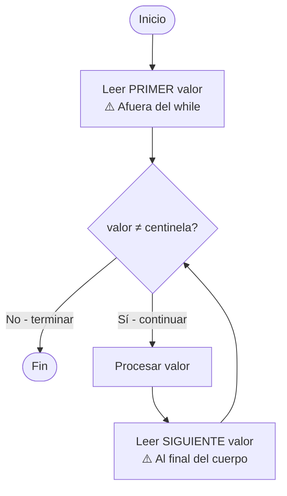

# 🔀 Estructuras de Control

---

## ¿Cuándo usar cada una?

| Estructura | Cuándo usarla | Ejemplo típico |
|---|---|---|
| `IF-THEN-ELSE` | Tomar una decisión según una condición | ¿El promedio es >= 6? |
| `FOR` | Cantidad de iteraciones **conocida de antemano** | Procesar los 7 días de la semana |
| `WHILE` | Cantidad de iteraciones **desconocida** (depende de una condición) | Leer datos hasta que el usuario ingrese -1 |

---

## IF-THEN-ELSE

```pascal
if condicion then
  instruccion_si_verdad
else
  instruccion_si_falso;

{ Con múltiples instrucciones, siempre usar BEGIN...END }
if promedio >= 6 then
begin
  writeln('Aprobado');
  writeln('Promedio: ', promedio:5:2);
end
else
  writeln('Desaprobado');
```

!!! warning "No se necesita BEGIN...END con una sola instrucción"
    Pero si tenés dudas, siempre es seguro ponerlos. El error más común es olvidarlos cuando agregás una segunda instrucción.

---

## FOR

```pascal
{ Recorre de inicio a fin, inclusive }
for i := 1 to 7 do
begin
  writeln('Día ', i);
end;
```

!!! info "Características del FOR"
    - La variable contadora **se incrementa automáticamente** en 1 cada vez
    - El rango se evalúa **antes de arrancar** el loop
    - Si `inicio > fin`, el cuerpo **nunca se ejecuta**
    - Para contar al revés: `for i := 10 downto 1 do`

---

## WHILE — el patrón con centinela



```pascal
{ ✅ Patrón correcto }
write('Legajo (0 para terminar): ');
readln(legajo);             { ← primer read AFUERA }

while legajo <> 0 do
begin
  { procesar }
  write('Legajo (0 para terminar): ');
  readln(legajo);           { ← siguiente read AL FINAL }
end;
```

!!! danger "Error más común — leer solo dentro del while"
    ```pascal
    { ❌ Incorrecto — nunca entra si legajo arranca en 0,
       o nunca termina si el primer valor no es 0 sin leer el siguiente }
    while legajo <> 0 do
    begin
      readln(legajo);   { ← falta leer antes del while }
      { procesar }
    end;
    ```

---

## Ejemplo completo

Leer legajos y 3 notas por alumno. Terminar cuando el legajo es 0. Mostrar el promedio de cada alumno.

```pascal
program PromedioAlumnos;
var
  legajo: integer;
  nota1, nota2, nota3, promedio: real;
begin
  write('Legajo (0 para terminar): ');
  readln(legajo);

  while legajo <> 0 do
  begin
    write('Nota 1: '); readln(nota1);
    write('Nota 2: '); readln(nota2);
    write('Nota 3: '); readln(nota3);
    promedio := (nota1 + nota2 + nota3) / 3;
    writeln('Promedio alumno ', legajo, ': ', promedio:5:2);

    write('Legajo (0 para terminar): ');
    readln(legajo);
  end;
end.
```

---

<div class="nav-links" markdown="1">

## [➡️ Siguiente: Modularización](02_modularizacion.md)

</div>
