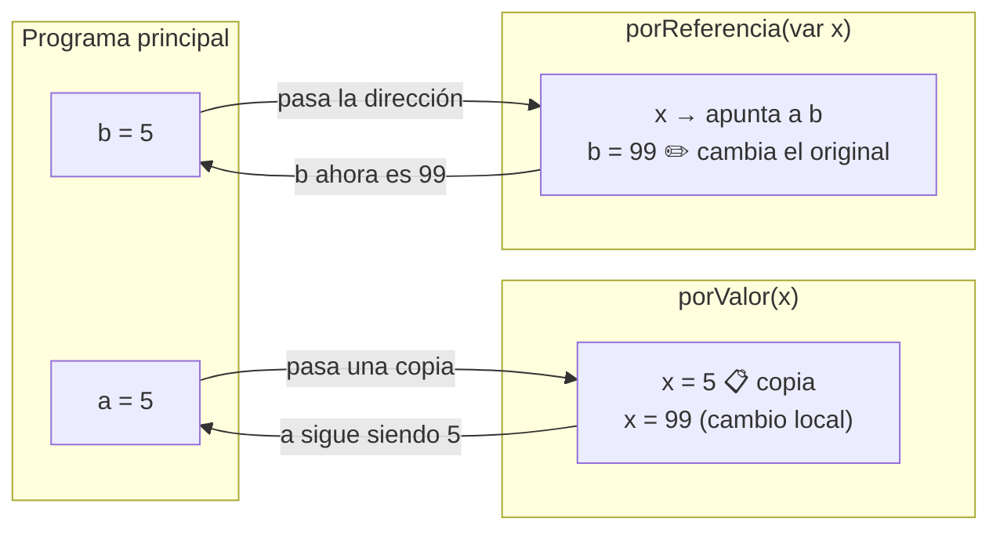

# 🧩 Modularización

Dividir un programa complejo en partes más pequeñas, reutilizables e independientes.

---

## FUNCTION vs PROCEDURE

| | `function` | `procedure` |
|---|---|---|
| **Devuelve** | Un único valor | Nada (o varios por `var`) |
| **Se usa en** | Expresiones: `x := f(...)` | Instrucciones: `p(...)` |
| **Cuándo** | Calcular algo: promedio, mínimo, `esPrimo` | Hacer algo: leer datos, mostrar resultados |

```pascal
{ FUNCTION — devuelve un valor real }
function calcularPromedio(n1, n2, n3: real): real;
begin
  calcularPromedio := (n1 + n2 + n3) / 3;  { así se "retorna" el valor }
end;

{ PROCEDURE — realiza una tarea }
procedure mostrarResultado(nombre: string; promedio: real);
begin
  writeln('Alumno: ', nombre, ' — Promedio: ', promedio:5:2);
end;
```

---

## Pasaje por VALOR vs por REFERENCIA



```pascal
{ Por VALOR — recibe una copia }
procedure porValor(x: integer);
begin
  x := 99;  { solo modifica la copia local, no afecta al original }
end;

{ Por REFERENCIA — recibe la dirección de la variable original }
procedure porReferencia(var x: integer);
begin
  x := 99;  { modifica el original }
end;

var a, b: integer;
begin
  a := 5; b := 5;
  porValor(a);        { a sigue siendo 5 }
  porReferencia(b);   { b ahora es 99    }
end.
```

!!! tip "¿Cuándo usar VAR?"
    | El módulo necesita... | Usar |
    |---|---|
    | Solo **leer** el dato | Sin `var` (por valor) |
    | **Modificar** el dato o **devolverlo** | Con `var` (por referencia) |

!!! warning "Regla de oro del parcial"
    **No declarar variables globales.** Toda comunicación entre el programa principal y los módulos debe ser exclusivamente a través de parámetros.

---

## Ejemplo completo modularizado

```pascal
program Alumnos;

function calcularPromedio(n1, n2, n3: real): real;
begin
  calcularPromedio := (n1 + n2 + n3) / 3;
end;

function estaAprobado(prom: real): boolean;
begin
  estaAprobado := prom >= 6.0;
end;

procedure informarResultado(nombre: string; n1, n2, n3: real);
var
  prom: real;
begin
  prom := calcularPromedio(n1, n2, n3);
  write('Alumno: ', nombre, ' — Promedio: ', prom:5:2, ' — ');
  if estaAprobado(prom) then
    writeln('APROBADO')
  else
    writeln('DESAPROBADO');
end;

{ Programa principal }
var nombre: string;
    n1, n2, n3: real;
begin
  readln(nombre);
  readln(n1); readln(n2); readln(n3);
  informarResultado(nombre, n1, n2, n3);
end.
```

!!! question "Para pensar"
    - ¿Por qué `nombre`, `n1`, `n2`, `n3` en `informarResultado` van **sin** `var`?
    - ¿Podría `calcularPromedio` ser un `procedure`? ¿Qué cambiaría?

---

## 🔬 Ver en Python Tutor

→ [Snippet: VAR vs valor en memoria](../pythontutor/pythontutor.md#var-vs-valor)

---

<div class="nav-links" markdown="1">

## [⬅️ Anterior](01_estructuras_control.md) | [➡️ Siguiente: Vectores y Registros](03_vectores_registros.md)

</div>
