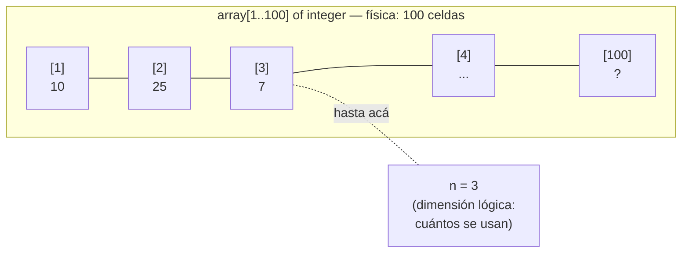

# 📊 Vectores y Registros

---

## Registro (record)

Agrupa datos de **tipos distintos** (heterogéneos) bajo un mismo nombre. Es como una ficha.

```pascal
type
  TInmueble = record
    tipo     : string;
    precio   : real;
    localidad: string;
  end;

var
  casa: TInmueble;
begin
  casa.tipo      := 'Casa';        { acceso con punto }
  casa.precio    := 150000;
  casa.localidad := 'La Plata';
  writeln(casa.tipo, ' en ', casa.localidad, ': $', casa.precio:8:2);
end.
```

---

## Vector (array)

Colección de datos del **mismo tipo** (homogéneos), accesibles por índice.

### Dimensión física vs lógica



```pascal
const MAX = 100;
type
  TVector = array[1..MAX] of integer;
var
  v: TVector;
  n: integer;   { dimensión LÓGICA: cuántos elementos hay realmente }
```

!!! warning "Siempre pasar n, no MAX"
    Los módulos reciben `n` (la cantidad real de elementos), nunca `MAX`.
    ```pascal
    { ✅ Correcto }
    procedure mostrar(v: TVector; n: integer);

    { ❌ Incorrecto }
    procedure mostrar(v: TVector);  { ¿cómo sabe hasta dónde llegar? }
    ```

---

## Vector de registros

```pascal
type
  TEmpleado = record
    nombre   : string;
    categoria: char;    { A, B, C, D o E }
    salario  : real;
  end;
  TEmpleados = array[1..MAX] of TEmpleado;

var emp: TEmpleados;
begin
  emp[1].nombre    := 'Ana';    { índice + campo }
  emp[1].categoria := 'A';
  emp[1].salario   := 85000;
end.
```

---

## Algoritmos sobre vectores

### Búsqueda sin orden — recorre todo

```pascal
i := 1;
encontrado := false;
while (i <= n) and (not encontrado) do
begin
  if v[i] = x then
    encontrado := true
  else
    i := i + 1;
end;
{ si encontrado=true, el índice es i }
```

### Búsqueda con orden — se detiene antes ⭐

```pascal
{ El vector está ordenado de menor a mayor }
i := 1;
encontrado := false;
superado   := false;
while (i <= n) and (not encontrado) and (not superado) do
begin
  if v[i] = x then
    encontrado := true
  else if v[i] > x then
    superado := true      { ya no tiene sentido seguir buscando }
  else
    i := i + 1;
end;
```

!!! tip "¿Por qué es más eficiente?"
    Si el vector es `[3, 7, 12, 20, 35]` y busco el 10:
    - Sin orden: comparo contra 3, 7, 12, 20, 35 → **5 comparaciones**
    - Con orden: comparo contra 3, 7, 12 → cuando veo 12 > 10, **paro** → **3 comparaciones**

### Ordenación por Selección

```
Para cada posición i (de 1 a n-1):
    Buscar el índice del MÍNIMO entre posición i y n
    Intercambiar v[i] con v[iMin]
```

```pascal
procedure seleccion(var v: TVector; n: integer);
var
  i, j, iMin, aux: integer;
begin
  for i := 1 to n - 1 do
  begin
    iMin := i;
    for j := i + 1 to n do
      if v[j] < v[iMin] then
        iMin := j;
    { intercambiar }
    aux     := v[i];
    v[i]    := v[iMin];
    v[iMin] := aux;
  end;
end;
```

### Vector contador

Contar elementos por categoría usando la categoría como índice:

```pascal
type
  TContadores = array['A'..'E'] of integer;

procedure contar(emp: TEmpleados; n: integer; var cont: TContadores);
var i: integer; c: char;
begin
  for c := 'A' to 'E' do cont[c] := 0;   { inicializar }
  for i := 1 to n do
    cont[emp[i].categoria] := cont[emp[i].categoria] + 1;
end;
```

---

---

## 🔬 Ver en Python Tutor

→ [Snippet: ordenación por selección paso a paso](../pythontutor/pythontutor.md#seleccion)

<div class="nav-links" markdown="1">

## [⬅️ Anterior](02_modularizacion.md) | [➡️ Siguiente: Listas Enlazadas](04_listas_enlazadas.md)

</div>
