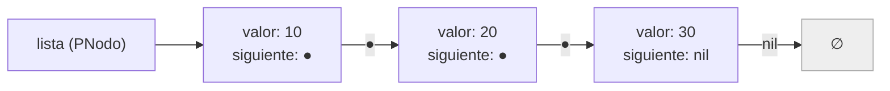
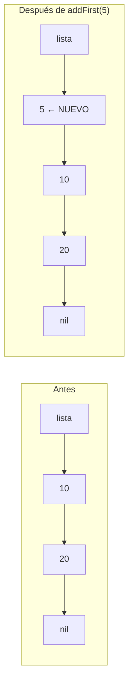
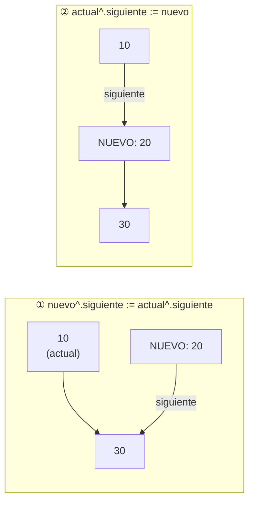

# 🔗 Listas Enlazadas

A diferencia de los vectores, las listas no tienen tamaño fijo: crecen y se achican durante la ejecución.

---

## Vector vs Lista

| | Vector | Lista |
|---|---|---|
| Tamaño | Fijo (`MAX`) declarado en compilación | Dinámico — crece en ejecución |
| Acceso | Directo por índice: `v[5]` | Secuencial — hay que recorrer |
| Inserción al inicio | Costosa (hay que desplazar todos) | Barata (solo cambiar punteros) |

---

## Estructura de un nodo



```pascal
type
  PNodo = ^TNodo;    { primero el puntero — forward declaration }
  TNodo = record
    valor    : integer;
    siguiente: PNodo;
  end;

var lista: PNodo;
begin
  lista := nil;   { lista vacía }
end.
```

!!! warning "El orden de declaración importa"
    `PNodo = ^TNodo` siempre va **antes** que `TNodo = record`. Pascal necesita que el tipo puntero esté declarado antes que el registro que lo usa internamente.

---

## Agregar al inicio — addFirst

El nuevo nodo se convierte en la nueva cabecera.



```pascal
procedure addFirst(var lista: PNodo; valor: integer);
var nuevo: PNodo;
begin
  new(nuevo);                    { 1. crear nodo en memoria }
  nuevo^.valor     := valor;     { 2. asignar dato }
  nuevo^.siguiente := lista;     { 3. el nuevo apunta al que era primero }
  lista            := nuevo;     { 4. lista ahora apunta al nuevo }
end;
```

!!! tip "¿Por qué lista va con VAR?"
    Porque el procedimiento modifica **quién es la cabecera**. Si no fuera `var`, el programa principal nunca se enteraría del cambio.

---

## Agregar al final — add

```pascal
procedure add(var lista: PNodo; valor: integer);
var nuevo, actual: PNodo;
begin
  new(nuevo);
  nuevo^.valor     := valor;
  nuevo^.siguiente := nil;

  if lista = nil then
    lista := nuevo              { lista estaba vacía }
  else
  begin
    actual := lista;
    while actual^.siguiente <> nil do   { llegar al último nodo }
      actual := actual^.siguiente;
    actual^.siguiente := nuevo;         { enlazar al final }
  end;
end;
```

---

## Recorrer una lista

```pascal
procedure mostrar(lista: PNodo);    { SIN var — no modifica la cabecera }
var actual: PNodo;
begin
  actual := lista;
  while actual <> nil do
  begin
    writeln(actual^.valor);
    actual := actual^.siguiente;
  end;
end;
```

!!! info "¿Cuándo va VAR en los módulos de lista?"
    | Módulo | ¿Modifica la cabecera? | ¿Usa VAR? |
    |---|---|---|
    | `addFirst` | Sí | ✅ |
    | `add` (a lista vacía) | Sí | ✅ |
    | `mostrar`, `buscar`, `contar` | No | ❌ |

---

## Buscar en una lista

```pascal
function buscar(lista: PNodo; x: integer): boolean;
var actual: PNodo;
begin
  actual := lista;
  while (actual <> nil) and (actual^.valor <> x) do
    actual := actual^.siguiente;
  buscar := actual <> nil;   { si salimos sin llegar a nil, lo encontramos }
end;
```

---

## Insertar en el medio

Insertar un nodo **después** de un nodo específico ya existente en la lista.

El truco está en el **orden de los dos pasos** — si los invertís, perdés el resto de la lista.



!!! danger "El orden importa — no invertir los pasos"
    ```pascal
    { ✅ Correcto }
    nuevo^.siguiente  := actual^.siguiente;  { 1ro: NUEVO apunta al siguiente }
    actual^.siguiente := nuevo;              { 2do: anterior apunta al NUEVO }

    { ❌ Incorrecto — perdés el resto de la lista }
    actual^.siguiente := nuevo;              { actual ya no apunta a 30... }
    nuevo^.siguiente  := actual^.siguiente;  { ...esto asigna nuevo a sí mismo }
    ```

```pascal
{ Insertar un valor nuevo DESPUÉS del nodo que contiene 'valorBuscar' }
procedure insertarDespuesDe(lista: PNodo; valorBuscar, valorNuevo: integer);
var
  nuevo, actual: PNodo;
begin
  { 1. Buscar el nodo de referencia }
  actual := lista;
  while (actual <> nil) and (actual^.valor <> valorBuscar) do
    actual := actual^.siguiente;

  { 2. Si lo encontramos, insertar después }
  if actual <> nil then
  begin
    new(nuevo);
    nuevo^.valor      := valorNuevo;
    nuevo^.siguiente  := actual^.siguiente;  { paso 1: enlazar hacia adelante }
    actual^.siguiente := nuevo;              { paso 2: enlazar hacia atrás }
  end;
end;
```

!!! info "¿Por qué lista NO necesita VAR acá?"
    Porque estamos insertando **en el medio**: la cabecera (`lista`) no cambia. Solo se modifican los punteros internos de nodos que ya existen. `lista` no necesita `var`.

    Si quisiéramos insertar **antes del primero** (nuevo caso borde), ahí sí cambia la cabecera y necesitaríamos `var lista`.

---

## ¿Cuándo va VAR? — tabla completa

| Módulo | ¿Modifica la cabecera? | ¿Usa VAR? |
|---|---|---|
| `addFirst` | Sí | ✅ |
| `add` (lista vacía) | Sí | ✅ |
| `add` (lista no vacía) | No | ❌ (pero se declara `var` por el caso vacío) |
| `insertarDespuesDe` | No | ❌ |
| `mostrar`, `buscar`, `contar` | No | ❌ |

---

## 🔬 Ver en Python Tutor

→ [Snippet: addFirst paso a paso en memoria](../pythontutor/pythontutor.md#listas-enlazadas)  
→ [Snippet: insertar en el medio](../pythontutor/pythontutor.md#insertar-en-el-medio)

---

## [⬅️ Anterior](03_vectores_registros.md) | [➡️ Siguiente: Corte de Control](05_corte_control.md)
