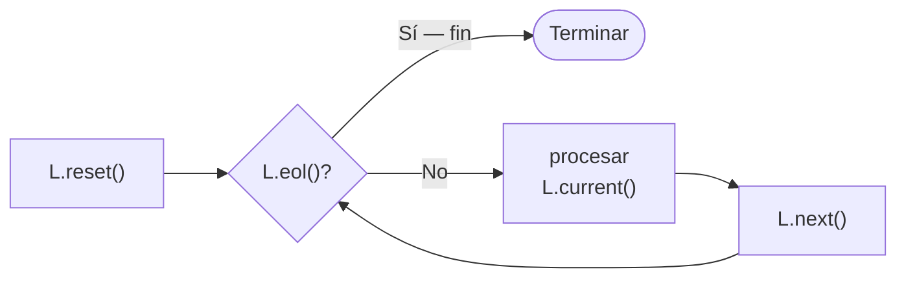

# 🔗 Listas Enlazadas

A diferencia de los vectores, las listas no tienen tamaño fijo: crecen y se achican durante la ejecución.

---

## Vector vs Lista

| | Vector | Lista |
|---|---|---|
| Tamaño | Fijo (`MAX`) declarado en compilación | Dinámico — crece en ejecución |
| Acceso | Directo por índice: `v[5]` | Secuencial — hay que recorrer |
| Inserción al inicio | Costosa (hay que desplazar todos) | Barata |

---

## La librería GenericLinkedList

En AyPI UNLP las listas se trabajan con la librería `GenericLinkedList`. Ella provee la estructura y los métodos — no hace falta manejar punteros manualmente.

### Importar y declarar el tipo

```pascal
uses GenericLinkedList;

type
  ListaEnteros = specialize LinkedList<integer>;
  { Para listas de registros: specialize LinkedList<TInmueble> }
```

### Crear una lista vacía

```pascal
var L: ListaEnteros;
begin
  L := ListaEnteros.create();  { lista vacía }
end.
```

---

## Agregar elementos

```pascal
L.add(elemento);       { agrega AL FINAL }
L.addFirst(elemento);  { agrega AL INICIO }
```

```pascal
{ Ejemplo: construir la lista 10 → 20 → 30 con add }
L := ListaEnteros.create();
L.add(10);
L.add(20);
L.add(30);
{ Resultado: 10 → 20 → 30 }
```

---

## Recorrer una lista — el patrón

Cuatro métodos que siempre se usan juntos:

| Método | Qué hace |
|---|---|
| `L.reset()` | Mueve el cursor al **primer** elemento |
| `L.eol()` | Devuelve `true` si llegamos al **final** (*end of list*) |
| `L.current()` | Devuelve el elemento en la posición actual |
| `L.next()` | Avanza el cursor al siguiente elemento |



```pascal
L.reset();
while not L.eol() do
begin
  writeln(L.current());   { usar el elemento actual }
  L.next();               { avanzar al siguiente }
end;
```

!!! warning "Olvidar L.next() — bucle infinito"
    Si no llamás `L.next()` al final del cuerpo del `while`, el cursor nunca avanza y el programa se cuelga.

---

## Módulos típicos

### armarLista — necesita VAR ⭐

```pascal
{ VAR porque el procedimiento REASIGNA L con create() }
procedure armarLista(var L: ListaEnteros);
var num: integer;
begin
  L := ListaEnteros.create();
  read(num);
  while num <> -1 do
  begin
    L.add(num);
    read(num);
  end;
end;
```

### recorrerLista — sin VAR

```pascal
{ Sin VAR: solo llama métodos, no reasigna L }
procedure recorrerLista(L: ListaEnteros);
begin
  L.reset();
  while not L.eol() do
  begin
    write(L.current(), ' ');
    L.next();
  end;
  writeln;
end;
```

### sumarLista — función sin VAR

```pascal
function sumarLista(L: ListaEnteros): integer;
var suma: integer;
begin
  suma := 0;
  L.reset();
  while not L.eol() do
  begin
    suma := suma + L.current();
    L.next();
  end;
  sumarLista := suma;
end;
```

---

## ¿Cuándo va VAR? — la regla

!!! tip "Regla para listas con GenericLinkedList"
    - **Con `var L`:** el módulo ejecuta `L := ListaTipo.create()` — está **reasignando** la variable.
    - **Sin `var L`:** el módulo solo llama métodos (`L.reset()`, `L.add()`, `L.current()`…) — aunque cambien el contenido interno, la variable `L` no se reasigna.

| Módulo | ¿Reasigna L? | ¿Usa VAR? |
|---|---|---|
| `armarLista` | Sí (`L := ListaE.create()`) | ✅ |
| `recorrerLista` | No | ❌ |
| `sumarLista` | No | ❌ |
| `buscarEnLista` | No | ❌ |

!!! info "Las listas son objetos (tipos referencia)"
    A diferencia de los vectores, las listas son un **tipo objeto**. Cuando pasás `L` sin `var`, el módulo y el programa principal comparten la **misma lista** en memoria — los métodos como `add()` sí modifican el contenido. Solo se necesita `var` cuando la propia variable se reasigna con `create()`.

---

## Lista de registros

```pascal
uses GenericLinkedList;

type
  TInmueble = record
    localidad: string;
    precio   : real;
  end;
  ListaInmuebles = specialize LinkedList<TInmueble>;

procedure armarListaInmuebles(var L: ListaInmuebles);
var inm: TInmueble;
begin
  L := ListaInmuebles.create();
  readln(inm.localidad);
  while inm.localidad <> 'FIN' do
  begin
    readln(inm.precio);
    L.add(inm);
    readln(inm.localidad);
  end;
end;

procedure mostrarInmuebles(L: ListaInmuebles);
var inm: TInmueble;
begin
  L.reset();
  while not L.eol() do
  begin
    inm := L.current();
    writeln(inm.localidad, ': $', inm.precio:10:2);
    L.next();
  end;
end;
```

---

## 🔬 Ver en Python Tutor

→ [Cómo funciona internamente una lista enlazada](../pythontutor/pythontutor.md#listas-enlazadas)

<div class="nav-links" markdown="1">

## [⬅️ Anterior](03_vectores_registros.md) | [➡️ Siguiente: Corte de Control](05_corte_control.md)

</div>
