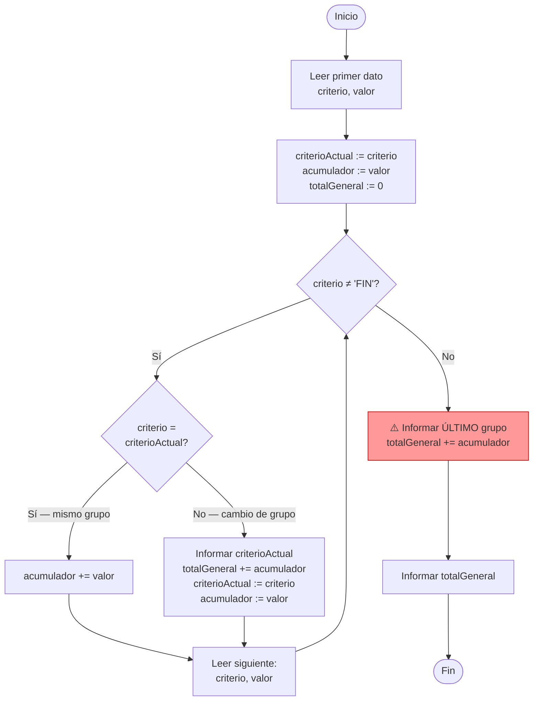

# ✂️ Corte de Control

Es uno de los temas **más recurrentes en el parcial**. Aparece cuando los datos vienen ordenados por un criterio y hay que procesar por grupos.

---

## ¿Cuándo se usa?

Cuando los datos están **ordenados** por algún criterio (localidad, departamento, categoría) y necesitás:
- Calcular totales **por grupo**
- Imprimir resultados **cuando cambia el criterio**

!!! example "Ejemplo típico"
    Inmuebles ordenados por localidad. Para cada localidad: imprimir el total de precios.
    ```
    La Plata   150000
    La Plata   200000   → cuando cambia a "Berisso": informar La Plata
    Berisso     90000
    Berisso    110000   → cuando llega FIN: informar Berisso
    FIN              0
    ```

---

## El patrón — memorizarlo



```pascal
program CortePorLocalidad;
var
  localidad, localidadActual: string;
  precio, totalLocalidad, totalGeneral: real;
begin
  totalGeneral := 0;

  { 1. Leer el PRIMER dato }
  readln(localidad, precio);
  localidadActual  := localidad;
  totalLocalidad   := 0;

  while localidad <> 'FIN' do
  begin
    if localidad = localidadActual then
      { mismo grupo: acumular }
      totalLocalidad := totalLocalidad + precio
    else
    begin
      { cambio de grupo }
      writeln('Localidad: ', localidadActual, ' $', totalLocalidad:8:2);
      totalGeneral    := totalGeneral + totalLocalidad;
      localidadActual := localidad;
      totalLocalidad  := precio;   { ← el dato ACTUAL ya es del nuevo grupo }
    end;
    readln(localidad, precio);
  end;

  { 2. ⚠️ Informar el ÚLTIMO grupo — nunca olvidar }
  writeln('Localidad: ', localidadActual, ' $', totalLocalidad:8:2);
  totalGeneral := totalGeneral + totalLocalidad;
  writeln('Total general: $', totalGeneral:10:2);
end.
```

---

## Los dos errores clásicos del parcial

!!! danger "Error 1 — Olvidar el último grupo"
    El `while` termina cuando llega `'FIN'`. El **último grupo** nunca tuvo un cambio de criterio que lo disparara, así que hay que informarlo **después del `while`** siempre.

    ```pascal
    { ❌ Falta esto después del while: }
    writeln(localidadActual, ': ', totalLocalidad:8:2);
    totalGeneral := totalGeneral + totalLocalidad;
    ```

!!! danger "Error 2 — Reiniciar el acumulador en 0 al cambiar de grupo"
    Cuando detectás el cambio de grupo, el dato que acabas de leer **ya pertenece al nuevo grupo**.

    ```pascal
    { ❌ Incorrecto }
    totalLocalidad := 0;        { se pierde el primer dato del nuevo grupo }

    { ✅ Correcto }
    totalLocalidad := precio;   { el dato actual ES el primero del nuevo grupo }
    ```

---

## [⬅️ Anterior](04_listas_enlazadas.md) | [🏋️ Ir a ejercicios](../ejercicios/ejercicios.md)
